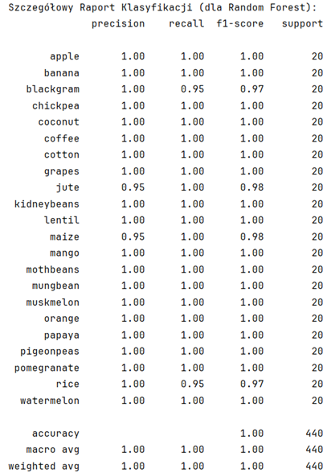
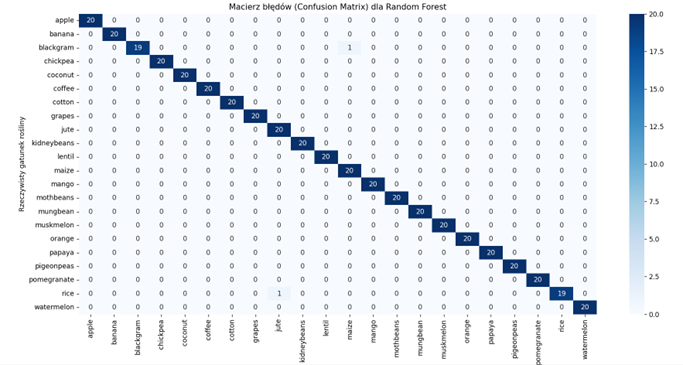
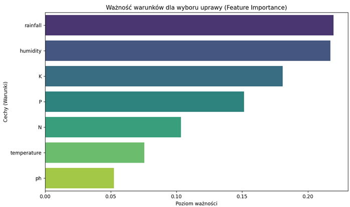

#  Inteligentne Rolnictwo – Rekomendacja upraw na podstawie warunków glebowych i pogodowych

**Autor:** Łukasz Wołoszyn

##  Charakterystyka projektu
Projekt rozwiązuje problem optymalizacji decyzji w rolnictwie poprzez zastosowanie algorytmów uczenia maszynowego (uczenie nadzorowane). Głównym celem jest zbudowanie modelu, który na podstawie zebranych pomiarów środowiskowych (temperatura, opady, minerały w glebie) automatycznie doradza rolnikowi, jaki gatunek rośliny należy zasadzić na danym polu w celu zmaksymalizacji plonów. 

Jest to klasyczny problem klasyfikacji wieloklasowej, w którym zestaw cech wejściowych przyporządkowywany jest do jednej z 22 możliwych klas docelowych.

##  Zbiór danych
Zbiór danych składa się z **2200 instancji** i nie zawiera braków danych. Obejmuje 7 cech numerycznych oraz 1 zmienną kategoryczną (docelową):

* `N` – zawartość azotu w glebie.
* `P` – zawartość fosforu w glebie.
* `K` – zawartość potasu w glebie.
* `temperature` – temperatura otoczenia w °C.
* `humidity` – wilgotność względna powietrza w %.
* `ph` – odczyn pH gleby.
* `rainfall` – średnia ilość opadów w mm.
* `label` **(Target)** – optymalny gatunek rośliny (łącznie 22 unikalne kategorie, np. ryż, kukurydza, kawa).

##  Preprocessing i Metodologia
* **Podział danych (Stratyfikacja):** Zastosowano parametr `stratify=y` w celu zachowania reprezentatywnych, równych proporcji każdej z 22 klas w zbiorze treningowym i testowym.
* **Skalowanie cech:** Ze względu na zróżnicowane rzędy wielkości atrybutów (np. setki milimetrów opadów vs. skala pH 0-14), dane poddano standaryzacji przy użyciu `StandardScaler`. Było to kluczowe zwłaszcza dla optymalnego działania algorytmu k-NN.

##  Modele i Optymalizacja
W ramach projektu zaimplementowano i porównano dwa algorytmy klasyfikacyjne przy użyciu biblioteki `scikit-learn`:

1. **Random Forest Classifier (Model główny)**
   * Wykorzystano technikę zespołową (ensemble learning) dla lepszego wychwytywania nieliniowych zależności.
   * Optymalizacja hiperparametrów za pomocą `GridSearchCV` z 5-krotną walidacją krzyżową (CV=5).
   * Przeszukana siatka: `n_estimators`: [50, 100, 200], `max_depth`: [None, 10, 20].
   * Optymalne parametry: `n_estimators=100`, `max_depth=None`.

2. **k-Nearest Neighbors (Model porównawczy)**
   * Zaimplementowano z parametrem `k=5`.

##  Wyniki
Modele ewaluowano na zbiorze testowym liczącym 440 instancji. Algorytm **Random Forest** osiągnął znakomitą skuteczność, przewyższając model porównawczy:

* **Accuracy (Random Forest):** 99.55%
* **Accuracy (k-NN):** 97.95%

Analiza szczegółowych metryk dla modelu Lasu Losowego wykazuje niemal bezbłędną zdolność predykcyjną. Dla zdecydowanej większości z 22 klas metryki **Precision**, **Recall** oraz **F1-score** wynoszą perfekcyjne **1.00**. Zaledwie w dwóch przypadkach (uprawy o zbliżonych wymaganiach) wystąpiły marginalne pomyłki (np. `rice` sklasyfikowany jako `jute`).

### Kluczowe wnioski z analizy ważności cech (Feature Importance)
Analiza wykazała jednoznacznie, że w badanym zbiorze czynnikami najbardziej determinującymi sukces danej uprawy są warunki klimatyczne: **dostępność wody (opady)** oraz **wilgotność powietrza**. Mają one znacznie większe znaczenie decyzyjne niż sam skład chemiczny gleby, podczas gdy najmniej istotnym parametrem okazało się pH gleby.

##  Wizualizacje

### Raport klasyfikacji

### Macierz błędów (Confusion Matrix)

### Ważność cech (Feature Importance)

